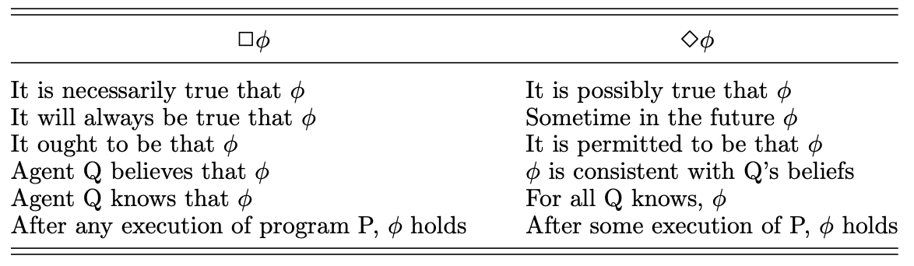
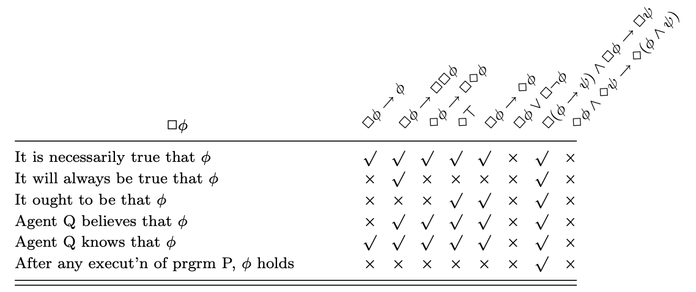
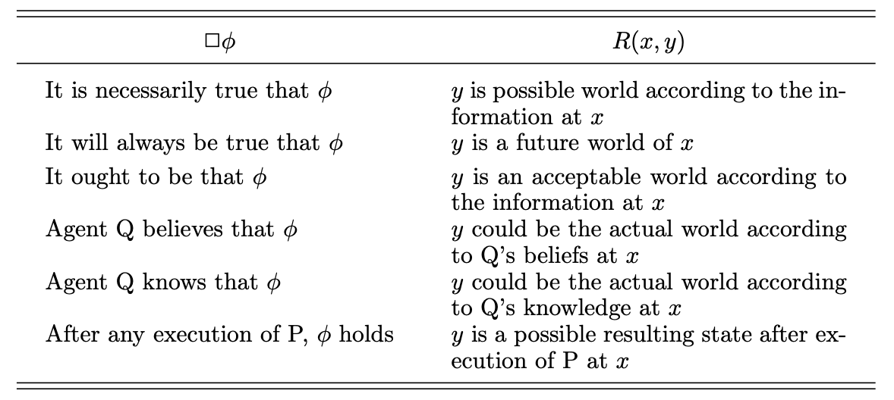
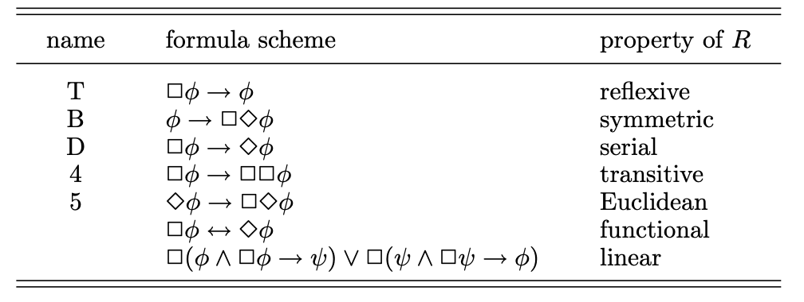
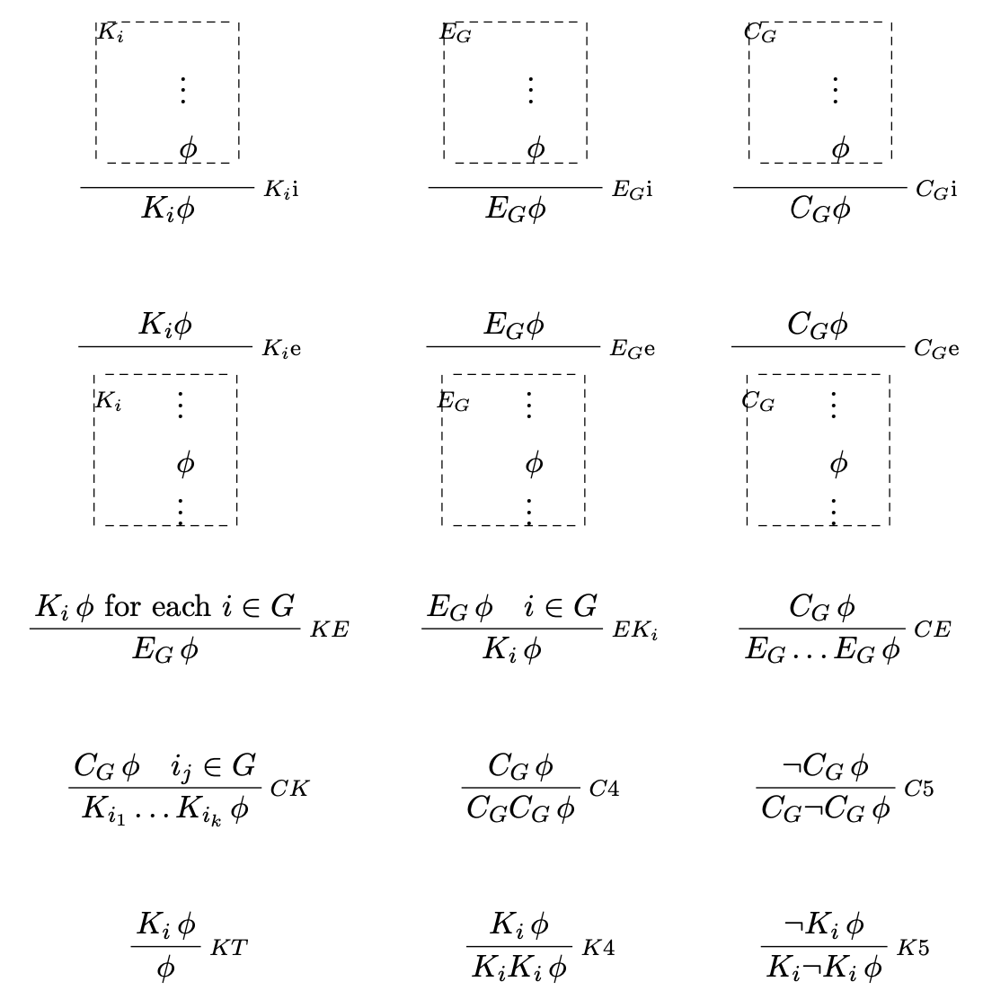
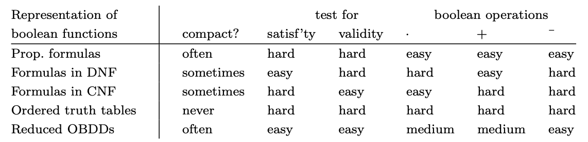

## Chapter 3: Verification by model checking

### 3.1 Motivation for verification

程序验证的几个维度选择：

- Proof-based vs. model-based：前者是证明$\Gamma\vdash \phi$，一般需要用户指导和其他知识；后者验证模型$\mathcal{M}\models\phi$，对于有限模型通常可自动化.
- Degree of automation：完全自动化；完全人工；半自动化.
- Full- vs. property-verification：前者描述系统的所有行为（开销巨大）；后者描述系统的单个属性.
- Intended domain of application：硬件/软件；串行/并发；reactive系统（如OS或嵌入式系统）/terminating系统（如普通C程序）.
- Pre- vs. post-development：在系统开发早期/晚期.

Model checking：automatic、model-based、property-verification

### 3.2 Linear-time temporal logic

#### LTL的语法

$$\phi ::= \top\mid \bot\mid p\mid (\neg\phi)\mid(\phi\wedge\phi)\mid(\phi\vee\phi)\mid(\phi\to\phi)\\\mid (\mathrm{X}\phi)\mid(\mathrm{F}\phi)\mid(\mathrm{G}\phi)\mid(\phi\mathrm{U}\phi)\mid(\phi\mathrm{W}\phi)\mid(\phi\mathrm{R}\phi)$$

#### LTL的语义

$\mathrm{X}$: 下一状态开始路径；$\mathrm{F}$: 未来某状态开始路径；$\mathrm{G}$: 所有未来状态开始路径；$\mathrm{U}$: until；$\mathrm{W}$: weak-until（可以不到达满足后者参数的状态）；$\mathrm{R}$: Release（将$\mathrm{W}$的两个参数颠倒一下，也是$\mathrm{U}$的对偶）.

#### LTL公式等价性

$$\neg\mathrm{G}\phi\equiv\mathrm{F}\neg\phi\qquad \neg\mathrm{F}\phi\equiv\mathrm{G}\neg\phi\qquad \neg\mathrm{X}\phi\equiv \mathrm{X}\neg\phi$$

$$\neg(\phi\mathrm{U}\psi)\equiv\neg\phi\mathrm{R}\neg\psi\qquad \neg(\phi\mathrm{R}\psi)\equiv\neg\phi\mathrm{U}\neg\psi$$

分配律：$\mathrm{F}(\phi\vee\psi)\equiv \mathrm{F}\phi\vee \mathrm{F}\psi$, $\mathrm{G}(\phi\vee\psi)\equiv\mathrm{G}\phi\wedge\mathrm{G}\psi$

$$\mathrm{F}\phi\equiv\top\mathrm{U}\phi\qquad \mathrm{G}\phi\equiv\bot\mathrm{R}\phi$$

强弱until的关系：$\phi\mathrm{U}\psi\equiv\phi\mathrm{W}\psi\wedge \mathrm{F}\psi$, $\phi\mathrm{W}\psi\equiv\phi\mathrm{U}\psi\vee G\psi$

#### LTL的全功能连接词集合（Adequate sets of connectives）

$\{\mathrm{U},\mathrm{X}\}, \{\mathrm{R},\mathrm{X}\}, \{\mathrm{W},\mathrm{X}\}$

**Theorem 3.10**：对任意LTL公式$\phi$和$\psi$，都有等价性$\phi\mathrm{U}\psi\equiv\neg(\neg\psi\mathrm{U}(\neg\phi\wedge\neg\psi))\wedge\mathrm{F}\psi$

### 3.3 Model checking

#### 互斥

- Safety：任意时间只能有一个进程在CS（$\mathrm{G}\neg(c_1\wedge c_2)$）
- Liveness：无论何时一个进程请求进入CS，它最终都会进入CS（$\mathrm{G}(t_1\to\mathrm{F}c_1)$）
- Non-blocking：一个进程总是能够请求进入CS（用LTL无法表达“对任意满足$n_1$的状态，它都有一个满足$t_1$的后继”）
- No strict sequencing：进程不需要按严格顺序进入CS（用LTL无法直接表达“存在一条路径，其中两个满足$c_1$不同状态的中间没有状态满足$c_1$”，可以用complement来表述：$G(c_1\to c_1\mathrm{W}(\neg c_1\wedge\neg c_1\mathrm{W}c_2))$）

#### NuSMV

- 接受输入：描述一个模型的程序、一些spec（时序逻辑公式）；输出：若这些spec成立，则输出`'true'`，否则输出一条导致spec为`false`的trace.
- 用关键字`LTLSPC`表示spec
- 默认情况下，各个模块同步执行；使用`process`关键字，可以异步执行.
- 关键字`FARENESS`：FARENESS $\phi$表示SMV在检查spec $\phi$时，会忽略所有$\phi$没有被无限次满足的路径.

### 3.4 Branching-time logic

- 一个状态满足一个LTL公式，若从该状态出发的**所有**路径都满足这个公式.
- 混合关于路径的全称与存在量词的属性不能用取补来检查，只能借助CTL.

#### CTL的语法

$$\phi ::= \top\mid \bot\mid p\mid (\neg\phi)\mid(\phi\wedge\phi)\mid(\phi\vee\phi)\mid(\phi\to\phi)\\\mid (\mathrm{AX}\phi)\mid(\mathrm{EX}\phi)\mid(\mathrm{AF}\phi)\mid(\mathrm{EF}\phi)\mid(\mathrm{AG}\phi)\mid(\mathrm{EG}\phi)\\\mid\mathrm{A}(\phi\mathrm{U}\phi)\mid\mathrm{E}(\phi\mathrm{U}\phi)$$

- 规定：`X, F, G, U`之前必须有`A`或`E`，`A`或`E`之后必须有`X, F, G, U`

#### CTL的语义

只需知道$\mathrm{A}\phi$表示从当前状态开始的所有路径都满足$\phi$；$\mathrm{E}\phi$表示存在某条从当前状态开始的路径满足$\phi$.

#### CTL公式等价性

$\neg\mathrm{AF}\phi\equiv\mathrm{EG}\neg\phi\qquad \neg\mathrm{EF}\phi\equiv\mathrm{AG}\neg\phi\qquad \neg\mathrm{AX}\phi\equiv\mathrm{EX}\neg\phi$

$\mathrm{AF}\phi\equiv\mathrm{A}[\top\mathrm{U}\phi]\qquad\mathrm{EF}\phi\equiv\mathrm{E}[\top\mathrm{U}\phi]$

#### CTL的全功能连接词集合（Adequate sets of connectives）

$\{\mathrm{AX},\mathrm{EX}\}$中的至少一个，以及$\{\mathrm{EG},\mathrm{AF},\mathrm{AU},\mathrm{EU}\}$中的至少一个

### 3.5 CTL* and the expressive powers of LTL and CTL

Insight: 存在LTL能表达而CTL无法表达的公式，如LTL中的$\mathrm{F} p\to \mathrm{F}q$

- CTL*：去掉了每个`X, U, F, G`前必须有`A, E`的约束，语法包含两类公式：
  - 状态公式（state formulas）：$\phi::=\top\mid p\mid (\neg\phi)\mid(\phi\wedge\phi)\mid\mathrm{A}[\alpha]\mid\mathrm{E}[\alpha]$
  - 路径公式（path formulas）：$\alpha::=\phi\mid(\neg\alpha)\mid(\alpha\wedge\alpha)\mid(\alpha\mathrm{U}\alpha)\mid(\mathrm{G}\alpha)\mid(\mathrm{F}\alpha)\mid(\mathrm{X}\alpha)$

- LTL公式$\alpha$等价于CTL\*公式$\mathrm{A}[\alpha]$；CTL也是CTL\*的子集，将$\alpha$限制为$\alpha::=(\phi\mathrm{U}\phi)\mid(\mathrm{G}\phi)\mid(\mathrm{F}\phi)\mid(\mathrm{X}\phi)$
- 尽管CTL不支持路径公式之间的布尔组合，但可以将其等价转换为CTL能表达的公式，如$\mathrm{E}[\mathrm{F}p\wedge\mathrm{F}q]\equiv \mathrm{EF}[p\wedge\mathrm{EF}q]\vee\mathrm{EF}[q\wedge\mathrm{EF}p]$
- 尽管LTL不支持“过去操作符“（如since, once等），但可以将过去操作符等价转换为LTL能表达的公式；但是，“过去操作符”可以增加CTL的表达能力，因为它们可以用来检查那种forward-unreachable的状态.

### 3.6 Model-checking algorithms

- 问题定义
  - Option1: 输入模型$\mathcal{M}$、公式$\phi$和状态$s_0$，验证是否$\mathcal{M},s_0\models \phi$，输出`'yes'`或`'no'`.
  - Option2: 输入模型$\mathcal{M}$和公式$\phi$，输出使得模型$\mathcal{M}$满足$\phi$的所有状态$s$.

#### CTL Model-checking标记算法

1. 将$\phi$转化为Adequate set里面的连接符形式
2. 用$\phi$的各个子公式标记$\mathcal{M}$的状态，从最小的子公式开始，逐步逼近$\phi$

#### 更高效的算法变体

用`EX, EU, EG`作为Adequate set，对于`EX, EU`，用前面的算法；对于$\mathrm{EG}\phi$，仅保留满足$\phi$的状态，找到这些状态的强连通分量，再使用反向BFS找到所有可以到达强连通分量的状态.

#### 公平性

- 用`!st=c`这个FARENESS约束来保证：无论进程在什么状态，未来总有一个不在CS里面的状态.
- 一条计算路径是公平的，当且仅当它所有的后缀也是公平的.

#### LTL Model-checking算法

- 比CTL复杂的地方在于：公式的子公式需要在路径上进行检验，而不是在状态上.
- 基本策略
  1. 为公式$\neg\phi$构造自动机$A_{\neg\phi}$，它编码了所有满足$\neg\phi$的trace（即不满足$\phi$的trace），其中一个trace是一个包含谓词原子值的串.
  2. 将自动机$A_{\neg\phi}$与模型$\mathcal{M}$结合起来，得到一个传递系统，所含路径是自动机和模型系统的路径的交集.
  3. 在传递系统中寻找是否存在由$s$生成的某个状态开始的路径，若存在，则可以解释为一条从$\mathcal{M}$中的$s$开始的不满足$\phi$的路径.

### 3.7 The fixed-point characterisation of CTL

本节目的：证明$SAT_{AF}$和$SAT_{EU}$的termination和correctness.

#### 单调函数（Monotone functions）

- 定义：设$S$是一个状态集合，$F:\mathcal{P}(S)\to\mathcal{P}(S)$是作用在$S$的幂集上的一个函数，则$F$是单调的当且仅当对任意的$X,Y\subseteq S$，都有$X\subseteq Y$可推导出$F(X)\subseteq F(Y)$. $S$的一个子集$X$被称为$F$的不动点当且仅当$F(X)=X$.

- **Theorem 3.24**：设$S$是集合$\{s_0,s_1,\dots,s_n\}$，若$F:\mathcal{P}(S)\to\mathcal{P}(S)$是一个单调函数，那么$F^{n+1}(\emptyset)$是$F$的最小不动点，且$F^{n+1}(S)$是$F$的最大不动点.

#### $SAT_{EG}$的正确性

- $[[\mathrm{EG}\phi]]=[[\phi]]\cap\mathrm{pre}_{\exists}([[\mathrm{EG}\phi]])$
- 设$S$有$n+1$个元素，函数$F(X)=[[\phi]]\cap\mathrm{pre}_{\exists}(X)$是单调函数，$[[\mathrm{EG}\phi]]$是$F$的最大不动点，且$[[\mathrm{EG}\phi]]=F^{n+1}(S)$.

#### $SAT_{EU}$的正确性

- $[[E[\phi\mathrm{U}\psi]]]=[[\psi]]\cup([[\phi]]\cap\mathrm{pre}_{\exists}[[\mathrm{E}[\phi\mathrm{U}\psi]]])$
- 设$S$有$n+1$个元素，函数$G(X)=[[\psi]]\cup([[\psi]]\cap\mathrm{pre}_{\exists}(X))$是单调函数，$[[\mathrm{E}(\phi\mathrm{U}\psi)]]$是$G$的最小不动点，且$[[\mathrm{E}(\phi\mathrm{U}\psi)]]=G^{n+1}(\empty)$

## Chapter 4: Program verification

- 前一章的model checking方法适合验证那种进程通讯的系统（control是main issue但没有复杂的data，有限状态），但对于单处理器的串行程序（non-trivial data，无限状态）就不适用.
- 本章的方法：proof-based、semi-automatic、property-oriented，domain是sequential transformational programs（预期会终止，不同于reactive system），被用于程序的片段.

### 4.1 Why should we specify and verify code?

- Documentation（文档）：描述程序的spec，可用合适的逻辑来形式化表述spec
- Time-to-market：debug大型系统费时费力而易错，通过形式化验证，可在规划阶段排除大多数错误
- Refactoring（重构）：属性特定的、已验证的软件更易用
- Certification audits：安全攸关系统

### 4.2 A framework for software verification

- 框架
  1. 将非形式化的需求描述$R$转化为用某种符号逻辑表达的“等价”公式$\phi_R$.
  2. 写一个程序$P$，它用来实现$\phi_R$.
  3. 证明程序$P$满足公式$\phi_R$.

- 兼顾非形式化规范和形式化规范的重要性：不可能保证$\phi_R$等价于$R$.

#### 我们关注的核心的编程语言

三部分：整数表达式、布尔表达式、命令.

- `E ::= n | x | (-E) | (E+E) | (E-E) | (E*E)`
- `B ::= true | false | (!B) | (B&B) | (B||B) | (E<E)`
- `C ::= x=E | C;C | if B {C} else {C} | while B {C}`

#### Hoare三元组

- 定义：形式$(\phi)P(\psi)$称为Hoare三元组，$\phi$是precondition，$\psi$是postcondition. 一个store或state是指每个变量$x$的赋值函数$l(x)$. 要求$\phi$和$\psi$中的量词仅仅约束不在$P$中的变量.

#### 部分正确性（Partial correctness）

- 定义：三元组$(\phi)P(\psi)$满足部分正确性，若对于任意的满足$\phi$的状态，在$P$能终止的前提下，都能在执行完$P$后满足$\psi$. 记为$\models_{\mathrm{par}}(\phi)P(\psi)$.

#### 完全正确性（Total correctness）

- 定义：三元组$(\phi)P(\psi)$满足完全正确性，若对于任意的满足$\phi$的状态，$P$都能终止并且最终状态满足$\psi$. 记为$\models_{\mathrm{tot}}(\phi)P(\psi)$.
- 证明完全正确性一般分为证明部分正确性和证明终止性.
- soundness: 若$\vdash_{\mathrm{par}}(\phi)P(\psi)$合法，则$\models_{\mathrm{par}}(\phi)P(\psi)$成立；completeness: 若$\models_{\mathrm{par}}(\phi)P(\psi)$成立，则$\vdash_{\mathrm{par}}(\phi)P(\psi)$合法. （$tot$同理）
- 用逻辑变量（logical variable）$x_0$等来表示程序变量（program variable）的固定值/初始值.

### 4.3 Proof calculus for partial correctness

#### 证明规则

Composition, Assignment, If-statement, Partial-while, Implied

- 赋值（Assignment）：无前提，要求$(\psi[E/x]x=E(\psi))$. 若要在`x=E`后满足$\psi$，则要在将$x$替换为$E$后满足$\psi[E/x]$. 这个rule从后往前证明要比从前往后证明更容易.

- 循环（Partial-while）：前提为$(\psi\wedge B)C(\psi)$，结论为$(\psi)\mathrm{while}B\{C\}(\psi\wedge\neg B)$. 不变量$\psi$至关重要.
- 蕴含（Implied）：增强前置条件/减弱后置条件.

### 4.4 Proof calculus for total correctness

- Total-while在Partial-while的基础上，多了一个严格decrease的变量，前提为$(\eta\wedge B\wedge 0\le E=E_0)C(\eta\wedge 0\le E<E_0)$，结论为$(\eta\wedge 0\le E)\mathrm{while}B\{C\}(\eta\wedge\neg B)$.

### 4.5 Programming by contract

为一段程序写contract（合同），`assumes`规定了前置条件，`guarantees`规定了后置条件，`modified only`规定了程序执行过程中哪个程序变量的值可能发生变化. 注意要避免循环论证，可以通过判断调用图有无环来判断.

## Chapter 5: Modal logics and agents

### 5.1 Modes of truth

模态逻辑添加了表示不同truth模式的连接词，描述与知识、必要性或时间有关的truth.

### 5.2 Basic modal logic

#### 语法

$\phi::=\bot\mid\top\mid p\mid(\neg\phi)\mid(\phi\wedge\phi)\mid(\phi\vee\phi)\mid(\phi\to\phi)\mid(\phi\leftrightarrow\phi)\mid(\Box\phi)\mid(\Diamond\phi)$

#### 语义

- 基本模态逻辑的一个模型$\mathcal{M}$（Kripke model）由三部分组成：
  - 一个集合$W$，其中的元素被称为世界（world）；
  - $W$上的一个关系$R$（$R\subseteq W\times W$），称为可达关系（accessibility relation），用$R(x,y)$来表示$(x,y)\in R$；
  - 一个函数$L:W\to\mathcal{P}(\mathrm{Atoms})$，称为标记函数（labelling function）.

- 需要注意的是：(1) $x\Vdash\Box\psi$当且仅当对于任意$R(x,y)$中的$y\in W$，有$y\Vdash\psi$. (2) $x\Vdash\Diamond\psi$当且仅当存在$y\in W$使得$R(x,y)$且$y\Vdash\psi$. （相当于CTL里面的AX和EX）其余的规则都很符合直觉.
- 反直觉的一个case：$x\Vdash\Box\bot$成立当且仅当$x$没有可达世界.

#### Formula和formula schemes

- 有相同“形状”的一簇公式，称为formula schemes，比如$\phi\to\Box\Diamond\phi$是一个formula scheme. 有该formula scheme的形状的公式称为scheme的实例（instance），如$p\to\Box\Diamond p$.

#### 模态公式之间的等价性

- 我们称模态逻辑公式的集合$\Gamma$语义推导出公式$\psi$，若模型$\mathcal{M}=(W,R,L)$中的任意世界$x$，若对任意$\phi\in\Gamma$且$x\Vdash\phi$都有$x\Vdash\psi$. 此时，我们称$\Gamma\models\psi$成立. 若$\phi\models\psi$且$\psi\models\phi$，则$\phi$和$\psi$语义等价，记为$\phi\equiv\psi$.

- $\neg\Box\phi\equiv \Diamond\neg\phi\qquad \neg\Diamond\phi\equiv\Box\neg\phi$
- $\Box(\phi\wedge\psi)\equiv\Box\phi\wedge\Box\psi\qquad \Diamond(\phi\vee\psi)\equiv\Diamond\phi\vee\Diamond\psi$

- $\Box\top\equiv\top$但不等价于$\Diamond\top$；$\Diamond\bot\equiv\bot$但不等价于$\Box\bot$.（存在性）

#### 合法公式（Valid formulas）

- 定义：基本模态逻辑中的一个公式$\phi$是合法（valid）的，若在所有模型中的所有世界都为真，也即$\models\phi$成立.

### 5.3 逻辑工程（Logic engineering）

- 必要性（Necessity）：物理必要性（宇宙的规律自身必要性）；逻辑必要性（无法不给这些论断yes的回答）

#### 可达性关系的重要性质

- $R(x,y)$可以解释为：根据$Q$对$x$的认知，$y$可能是真实世界，也即如果真实世界是$x$，那么$Q$不能排除真实世界是$y$的可能性.
- 
- 可以考察$R$是否具有自反、对称、传递等性质

#### 对应理论（Correspondence theory）

- 定义
  - 一个框架（frame）$\mathcal{F}=(W,R)$是一个世界集合$W$和一个$W$上的二元关系$R$.（相当于没有标记函数的Kripke模型）
  - 一个框架$\mathcal{F}=(W,R)$满足一个基本模态逻辑公式$\phi$，若对于每个标记函数$L:W\to\mathcal{P}(\mathrm{Atoms})$和每个$w\in W$，都有$\mathcal{M},w\Vdash\phi$成立，其中$\mathcal{M}=(W,R,L)$. 我们记为$\mathcal{F}\models\phi$.
- 定理
  - 以下语句是等价的：(1) $R$具有自反性；(2) $\mathcal{F}$满足$\Box\phi\to\phi$；(3) $\mathcal{F}$满足$\Box p\to p$.
  - 以下语句是等价的：(1) $R$具有传递性；(2) $\mathcal{F}$满足$\Box\phi\to\Box\Box\phi$；(3) $\mathcal{F}$满足$\Box p\to\Box\Box p$.
- serial: $\forall x\exists y, R(x,y)$; Euclidean: $\forall x,y,z,R(x,y)\wedge R(x,z)\to R(y,z)$; functional: 对每个$x$，有唯一的$y$使得$R(x,y)$; linear: $\forall x,y,z\in W, R(x,y)\wedge R(x,z)\to R(y,z)\vee y=z\vee R(z,y)$.

#### 一些模态逻辑

- 定义：设$\mathbb{L}$是模态逻辑formula schemes的集合，$\Gamma\cup\{\psi\}$是基本模态逻辑公式的集合.

  - 集合$\Gamma$在实例替换下闭合，当且仅当若$\phi\in\Gamma$，则$\phi$的任意实例替换仍然在$\Gamma$中.
  - 设$\mathbb{L}_c$是包含$\mathbb{L}$中的所有实例的最小集合.
  - $\Gamma$语义推导出$\mathbb{L}$中的$\psi$，当且仅当$\Gamma\cup\mathbb{L}_c$语义推导出基本模态逻辑中的$\psi$. 此时$\Gamma\models_{\mathbb{L}}\psi$成立.

- 模态逻辑：K

  - 最弱的模态逻辑，无formula schemes，$\mathbb{L}=\emptyset$. 

- 模态逻辑：KT45

  - 也称为S5. $\mathbb{L}=\{T,4,5\}$. 用来描述knowledge：

    - T: agent $Q$只知道真的东西；
    - 4: 若agent $Q$知道某个东西，那么它知道它知道这个东西；
    - 5: 若agent $Q$不知道某个东西，那么它知道它不知道这个东西；

    - K: logical omniscience（逻辑全知），agent的知识在逻辑结论下闭合.

  - KT45中的任意模态操作符和否定符所组成的串等价于下面之一：$-$, $\Box$, $\Diamond$, $\neg$, $\neg\Box$, $\neg\Diamond$，其中$-$是指没有任何否定或模态操作符.

- 模态逻辑：KT4

  - 也称为S4.
  - KT4中的任意模态操作符和否定符所组成的串等价于下面之一：$-$, $\Box$, $\Diamond$, $\Box\Diamond$, $\Diamond\Box$, $\Box\Diamond\Box$, $\Diamond\Box\Diamond$, $\neg$, $\neg\Box$, $\neg\Diamond$, $\neg\Box\Diamond$, $\neg\Diamond\Box$, $\neg\Box\Diamond\Box$, $\neg\Diamond\Box\Diamond$.

- **Intuitionistic propositional logic**

  - 一个Intuitionistic propositional logic模型是一个KT4模型$\mathcal{M}=(W,R,L)$，其中$R(x,y)$总是蕴含着$L(x)\subseteq L(y)$. 给定一个命题逻辑公式，除了$\to$和$\neg$之外都直接用来定义$x\Vdash\phi$. 对于$\phi_1\to\phi_2$，我们定义$x\Vdash\phi_1\to\phi_2$当且仅当对任意$y$且$R(x,y)$，若$y\Vdash\phi_1$则有$y\Vdash\phi_2$. 对于$\neg\phi$，我们定义$x\Vdash\neg\phi$当且仅当对任意$y$且$R(x,y)$，我们有$y\not\Vdash\phi$.
  - 排中律不成立.

### 5.4 Natual deduction

模态逻辑的额外规则：$\Box$ introduction和$\Box$ elimination，即(1) 若$\phi$出现在虚线框的末尾，那么$\Box\phi$可能会放入虚线框之后；(2) 若$\Box$出现在一个证明中，那么$\phi$可能会放入后续的虚线框中.

#### KT45的额外规则

- $\frac{\Box\phi}{\phi}T\qquad \frac{\Box]\phi}{\Box\Box\phi}4\qquad \frac{\neg\Box\phi}{\Box\neg\Box\phi}5$

### 5.5 Reasoning about knowledge in a multi-agent system

- 多Agent系统：不同的agent对世界有不同的认知.
- Reasoning about knowledge是指一个团体中的agents不仅考虑世界的事实，还考虑团体中其他agents的知识. 例子：博弈论、经济学、密码学、协议等.

#### 有趣的例子

1. The wise-men puzzle：三个人被戴帽子，一共有3顶红帽子和2顶白帽子，三个人轮流说自己是否知道自己头上是什么颜色的帽子. 若前两个人都说不知道，那么第三个人就能确定自己头上是红帽子.
2. The muddy-children puzzle：前者的并行版. 有很多孩子在花园里玩耍，有$k$（$k\ge1$）个孩子前额沾了泥土，每个孩子可以看见其他孩子前额的泥土，但看不到自己的. 
   - 场景一：父亲反复询问是否有人知道自己前额有泥土. 第一次所有人都异口同声地回答了no，因为无法从别人的no中学到什么东西，所以一直回答no.
   - 场景二：父亲首先宣布至少有一个人前额有泥土，然后他反复询问是否有人知道自己前额有泥土. 第一次所有人都回答了no. 在前$k-1$次所有人都回答no，直到第$k$次前额有泥土的人会回答yes.
   - 两个场景的重要区别：尽管每个人都知道父亲宣布的内容，但父亲的宣布使得这句话成为了他们之中的共识，他们才知道所有其他人都知道这件事. 例如$k=2$，Ramon和Candy前额有泥土，他们两个都知道除他自己之外有人前额有泥土，但是如果父亲不宣布，Ramon就不知道Candy知道有人前额有泥土，对他来说，Candy可能是唯一一个前额有泥土的人.

#### 模态逻辑KT45$^n$

- 公式$K_ip$表示“agent $i$知道$p$”. 公式$E_Gp$表示“每个group $G$中的人都知道$p$”. 公式$C_G\phi$表示$G$的共识，即$E_G\phi\wedge E_GE_G\phi\wedge E_GE_GE_G\phi\wedge\dots$ $D_G\phi$表示$\phi$的知识分布在$G$中：尽管$G$中可能没有人知道它，但它们可以把各自的知识聚集在一起推出它.
- 语法：$\phi::=\bot\mid\top\mid p\mid(\neg\phi)\mid(\phi\wedge\phi)\mid(\phi\vee\phi)\mid(\phi\to\phi)\mid(\phi\leftrightarrow\phi)\\\mid(K_i\phi)\mid(E_G\phi)\mid(C_G\phi)\mid(D_G\phi)$

- 模型：$\mathcal{M}=(W,(R_i)_{i\in\mathcal{A}}, L)$，其中$\mathcal{A}$是$n$个agents组成的集合. $W$是可能世界的集合. 对任意$i\in\mathcal{A}$，$W$上的等价关系$R_i$别称为可达性关系（accessibility relation）. 标记函数$L:W\to\mathcal{P}(\mathrm{Atoms})$.
- 语义：除去trivial的，(1) $x\Vdash K_i\psi$当且仅当对任意$y\in W$，$R_i(x,y)$蕴含$y\Vdash\psi$. (2) $x\Vdash E_G\psi$当且仅当对任意$i\in G$都有$x\Vdash K_i\psi$. (3) $x\Vdash C_G\psi$当且仅当对任意$k\ge1$都有$x\Vdash E_G^k\psi$，其中$E_G^k$指$E_GE_G\dots E_G$k次. (4) $x\Vdash D_G\psi$当且仅当对任意$y\in W$，若对任意$i\in G$有$R_i(x,y)$，则有$y\Vdash\psi$.
- 可达性：定义G-reachable——$y$从$x$开始在$k$步G-reachable，若存在$w_1,w_2,\dots,w_{k-1}\in W$和$i_1,i_2,\dots,i_k\in G$使得$xR_{i_1}w_1R_{i_2}w_2\dots R_{i_{k-1}}w_{k-1}R_{i_k}y$，也即$R_{i_1}(x, w_1),R_{i_2}(w_1,w_2),\dots,R_{i_k}(w_k,y)$.
  - $x\Vdash E_G^k\phi$当且仅当对任意从$x$开始在$k$步G-reachable的$y$，有$y\Vdash\phi$.
  - $x\Vdash C_G\phi$当且仅当对任意从$x$开始G-reachable的$y$，有$y\Vdash\phi$.

- 一些合法公式（valid formulas）

  - $[]\phi\wedge \to []\psi$，其中$[]$可为$K_i,E_G,C_G,D_G$.
  - $[]\phi\to[][]\phi\quad\neg K_i\phi\to K_i\neg K_i\phi\quad K_i\phi\to\phi$，其中$[]$可为$K_i,D_G$.

- 自然推理规则

  

## Chapter 6: Binary decision diagrams

### 6.1 Respresenting boolean functions

- 布尔函数$f:\{0,1\}^n\to\{0,1\}$

- 命题公式（Propositional formula）：用$\wedge$表示$\cdot$，用$\vee$表示$+$，用$\neg$表示$\overline{sth}$，用$\top$和$\bot$分别表示1和0.
- 真值表：用表格方式列举$f(x,y)$里面$x,y,f(x,y)$的1/0情况.（浪费空间，但直观）
- 

#### 二叉决策树（Binary decision tree）

- 定义：非终结结点标记为布尔变量$x,y,z,\dots$，终结结点标记为0或1，每个非终结结点有两条边，一条是实线，一条是虚线. 设$T$是一棵有限二叉决策树，那么$T$决定了一个特殊的非终结结点变量的布尔函数：给定一个对各个布尔变量的0/1赋值，从$T$的根结点开始，若当前结点的赋值为0，则走虚线，否则走实线. 函数的值就是到达的终结结点的值.

#### 二叉决策图（Binary decision diagram）

- 比二叉决策树更加general
- subBDD：BDD在某给定结点以下的部分.
- 将一个BDD归约成更精简的形式的方法：（这些方法维护了DAG的属性）
  - C1. Removal of duplicate terminals.
  - C2. Removal of redundant tests.
  - C3. Removal of duplicate non-terminals.
- BDD的定义：一个BDD是一个有限的DAG，它拥有一个唯一的初始结点，所有的终结结点都标记为0或1，所有的非终结结点都标记为布尔变量，每个非终结结点都有两条指向其他结点的边，一条标记为0，一条标记为1. 若没有任意C1-C3的优化可以再应用，那么我们称BDD是reduced（已归约的）.
- 一个BDD表示一个**可满足**函数，若一个1-终结结点从根结点沿着一条一致路径（consistent path）可到达，其中一致路径是指路径上每个变量只有虚线或只有实线离开该变量所在的结点. **合法**函数：没有0-终结结点可到达.
- 对于$f\cdot g$，将$B_f$中所有的1-终结结点替换为$B_g$；对于$f+g$，将$B_f$中所有的0-终结结点替换为$B_g$；对于$\overline{f}$，将$B_f$中的0和1-终结结点互换.

#### 有序二叉决策图（Ordered BDDs）

- 定义：设$[x_1,\dots,x_n]$是一个无重复的有序变量列表，$B$是所有变量都在该列表中的BDD. 我们称BDD有顺序$[x_1,\dots,x_n]$，若$B$的所有变量标记都出现在该列表中，并且对于$B$中任意路径的所有出现在$x_i$后面的$x_j$都有$i<j$. 一个Ordered BDD（OBDD）是一个对某个变量列表有顺序的BDD.
- Reduced OBDD和布尔函数一一对应.
- 一般来说，选择的变量顺序对OBDD的size影响很大.
- Canonical representation的重要性：去除冗余变量；测试语义等价性；测试合法性；测试蕴含性（$f\cdot\overline{g}$）；测试可满足性.

### 6.2 Algorithms for reduced OBDDs

