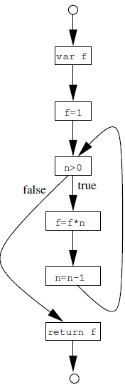

# Chapter 2. A Tiny Imperative Programming Language

Design *TIP* (tiny imperative programming language) for following chapters.

## 2.1. The Syntax of TIP

TIP programs interact with the world simply by reading input from a stream of integers (for example obtained from the user’s keyboard) and writing output as another stream of integers (to the user’s screen).
The language lacks many features known from commonly used programming languages, for example, global variables, nested functions, objects, and type annotations.

- Basic Expressions
  ```
  I -> 0 | 1 | -1 | 2 | -2 | ...       (integer constant)
  X -> x | y | z | ...                 (variable)
  E -> I                               (expression)
     | X
     | E + E | E - E | E * E | E / E | E > E | E == E
     | ( E )
     | input                           (read an integer from input stream)
  ```
- Statements
  ```
  S -> X = E;
     | output E;                       (write an integer to output stream)
     | S S
     |
     | if ( E ) { S } [ else { S } ]?  ([]? means optional)
     | while ( E ) { S }
  ```
- Functions: contain a function name, a list of parameters, local variable declarations, a body statement, and a return expression  
  ```
  F -> X ( X, ..., X ) { [ var X, ..., X; ]? S return E; }
  E -> X ( E, ..., E )
  ```
- Records: collection of fields, each having a name and a value
  ```
  E -> { X:E, ..., X:E }               (create records)
     | E.X                             (read field value)
  ```
- Pointers
  ```
  E -> alloc E   (allocate a new cell in the heap initialized with the value of the given expression and results in a pointer to the cell)
     | &X        (create a pointer to a program variable)
     | *E        (dereference a pointer value)
     | null
  S -> *X = E;   (assign values through pointers)
  ```
- Functions as Values
  ```
  E -> E ( E, ..., E )
  ```
- Programs
  ```
  P -> F ... F
  ```

A simplification:  assumption that all declared variable and function names are unique in a program, i.e. that no identifiers is declared more than once.

## 2.3. Normalization

- **normalization**: transform programs into equivalent but syntactically simpler ones
  - pointer dereference: use `*X` rather than `*E`
  - function call: use `X ( X, ..., X )` rather than `E ( E, ..., E )`
- For example, `x = f(y+3)*5;` can be normalized to `t1 = y+3; t2 = f(t1); x = t2*5;`

## 2.4. Abstract Syntax Trees

AST is suitable for **flow-insensitive** analyses which ignore the execution order of statements in a function or block.

For example, type analysis (Chapter 3), control flow analysis (Chapter 9), and pointer analysis (Chapter 10).

## 2.5. Control Flow Graphs

CFG is suitable for For **flow-sensitive** analysis, in particular dataflow analysis (Chapter 5).

A CFG is a directed graph contains:
- nodes: statements
- edges: possible flow of control
- entry: a single point of entry
- exit: a single point of exit

For example, the CFG of
```
iterate(n) {
  var f;
  f = 1;
  while (n>0) {
    f = f*n;
    n = n-1;
  }
  return f;
}
```
is
