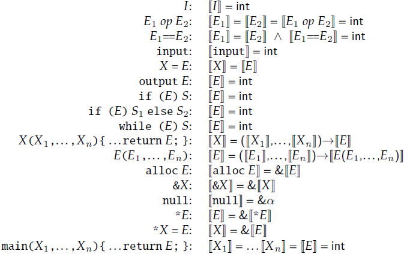
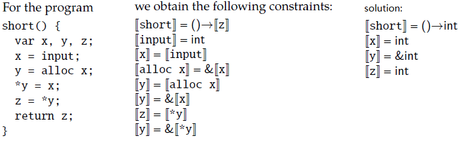
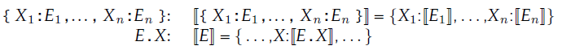

# Chapter 3. Type Analysis

**typability**: a program is typable if it satisfies a collection of type constraints that is systematically derived, typically from the program AST.

## 3.1. Types

language of types:
- integers: $\tau \to \text{int}$
- pointers: $\tau \to \&\tau$
- functions: $\tau \to (\tau,\dots,\tau)\to\tau$
- recursive: $\tau\to\mu\alpha.\tau | \alpha$
- type variables: $\alpha\to\alpha_1|\alpha_2|\dots$

## 3.2. Type Constraints

- $[[X]]$ means $X$'s type
- $[[X]]$ for local variable, function parameter, and function name $X$
- $[[E]]$ for non-identifier expression (a concrete node in the abstract syntax tree) $E$

The constraints are systematically defined for each construct in our language:

Example: 

## 3.3. Solving Constraints with Unification

并查集

## 3.4. Record Types

record types (struct): $\tau\to\{X:\tau,\dots,X:\tau\}$ . For example, the record type $\{a:int,b:int\}$ describes records that have two fields, a and b, both with integer values.

