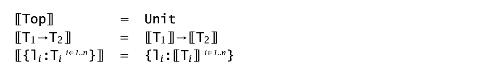
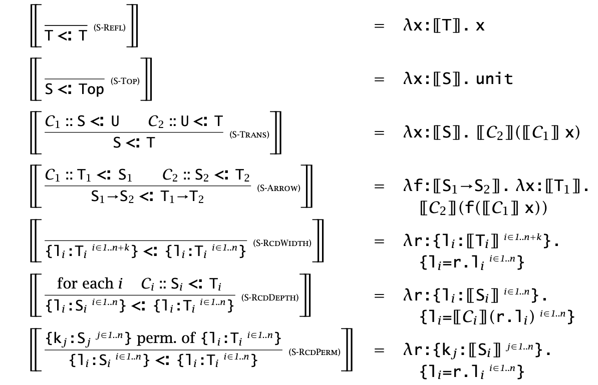
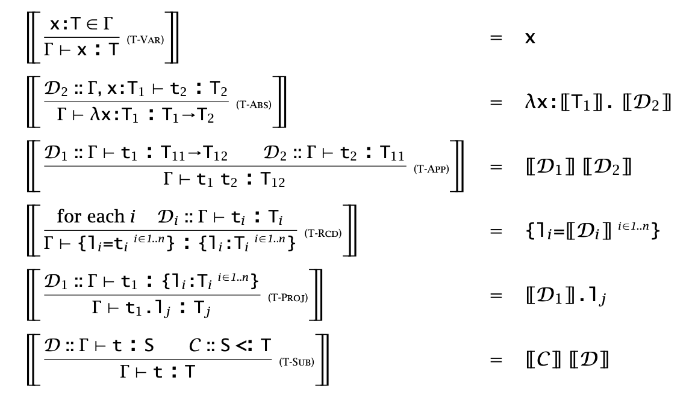
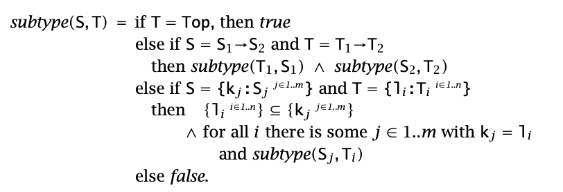

## Chapter 15: Subtyping

### 15.1 Subsumption

- Motivating example: `(λr:{x:Nat}. r.x) {x=0,y=1}` not typable in simply typed lambda-calculus. But it's always safe to pass an argument of type `{x:Nat,y:Nat}​` to a function that expects type `{x:Nat}`.
- `S` is a subtype of `T` (i.e., `S<:T`), if any term of type `S` can safely be used in a context where a term of type `T` is expected.
  - the elements of `S` are a subset of the elements of `T`. (subset semantics)
- **Rule of subsumption**
  - $\dfrac{\Gamma\vdash\texttt{t:S}\quad\texttt{S}<:\texttt{T}}{\Gamma\vdash\texttt{t:T}}$        (T-SUB)

### 15.2 The Subtype Relation

- **Reflexive**: $\texttt{S}<:\texttt{S}$        (S-REFL)
- **Transitive**: $\dfrac{\texttt{S}<:\texttt{U}\quad\texttt{U}<:\texttt{T}}{\texttt{S}<:\texttt{T}}$        (S-TRANS)
- Width subtyping rule: $\texttt{\{l}_i\texttt{:T}_i^{i\in 1\dots n+k}\texttt{\}}<:\texttt{\{l}_i\texttt{:T}_i^{i\in 1\dots n}\texttt{\}}$        (S-RCDWIDTH)
- Depth subtyping rule: $\dfrac{\textrm{for each }i\quad\texttt{S}_i<:\texttt{T}_i}{\{\texttt{l}_i\texttt{:S}_i^{i\in1\dots n}\texttt{\}}<:\{\texttt{l}_i\texttt{:T}_i^{i\in1\dots n}\texttt{\}}}$        (S-RCDDEPTH)
- $\dfrac{\texttt{\{k}_j\texttt{:S}_j^{j\in 1\dots n}\texttt{\}}\textrm{ is a permutation of }\texttt{\{l}_i\texttt{:T}_i^{i\in1\dots n}\texttt{\}}}{\texttt{\{k}_j\texttt{:S}_j^{j\in 1\dots n}\texttt{\}}<: \texttt{\{l}_i\texttt{:T}_i^{i\in 1\dots n}\texttt{\}}}$        (S-RCDPERM)
- $\dfrac{\texttt{T}_1<:\texttt{S}_1\quad \texttt{S}_2<:\texttt{T}_2}{\texttt{S}_1\to\texttt{S}_2<:\texttt{T}_1\to\texttt{T}_2}$        (S-ARROW)
- Supertype of every type: a new type constant $\texttt{Top}$
  - $\texttt{S}<:\texttt{Top}$        (S-TOP)

### 15.3 Properties of Subtyping and Typing

- Lemma [Inversion of the Subtype Relation]
  1. If $\texttt{S}<:\texttt{T}_1\to\texttt{T}_2$, then $\texttt{S}$ has the form $\texttt{S}_1\to\texttt{S}_2$, with $\texttt{T}_1<:\texttt{S}_1$ and $\texttt{S}_2<:\texttt{T}_2$.
  2. If $\texttt{S}<:\texttt{\{l}_i\texttt{:T}_i^{i\in1\dots n}\texttt{\}}$, then $\texttt{S}$ has the form $\texttt{\{k}_j\texttt{:S}_j^{j\in1\dots m}\texttt{\}}$, with at least the labels $\texttt{\{l}_i^{i\in1\dots n}\texttt{\}}$ — i.e., $\texttt{\{l}_i^{i\in1\dots n}\texttt{\}}\subseteq \texttt{\{k}_j^{j\in1\dots m}\texttt{\}}$ — and with $\texttt{S}_j<:\texttt{T}_i$ for each common label $\texttt{l}_i=\texttt{k}_j$.
- Theorem [Preservation]
  - If $\Gamma\vdash\texttt{t:T}$ and $\texttt{t}\to\texttt{t}'$, then $\Gamma\vdash\texttt{t}'\texttt{:T}$.
- Lemma [Canonical Forms]
  1. If $\texttt{v}$ is a closed value of type $\texttt{T}_1\to\texttt{T}_2$, then $\texttt{v}$ has the form $\lambda\texttt{x:S}_1\texttt{.t}_2$.
  2. If $\texttt{v}$ is a closed value of type $\texttt{\{l}_i\texttt{:T}_i^{i\in1\dots n}\texttt{\}}$, then $\texttt{v}$ has the form $\texttt{\{k}_a\texttt{=v}_a^{a\in1\dots m}\texttt{\}}$, with $\texttt{\{l}_i^{i\in1\dots n}\texttt{\}}\subseteq\texttt{\{k}_a^{a\in1\dots m}\texttt{\}}$.
- Theorem [Progress]
  - If $\texttt{t}$ is closed, well-typed term, then either $\texttt{t}$ is a value or else there is some $\texttt{t}'$ with $\texttt{t}\to\texttt{t}'$.

### 15.4 The Top and Bottom Type

- We **can** also complete the subtype relation with a *minimal* element.
  - Syntax: $\texttt{T}::=\texttt{Bot}$
  - Subtyping rules: $\texttt{Bot}<:\texttt{T}$       (S-BOT)
- Though useful, $\texttt{Bot}$ complicates the problem of building a typechecker.

### 15.5 Subtyping and Other Feature

#### Ascription and Casting

- Up-cast: $\dfrac{\Gamma\vdash\texttt{t:S}\quad\texttt{S}<:\texttt{T}}{\Gamma\vdash\texttt{t as T: T}}$
- Down-cast: $\dfrac{\Gamma\vdash\texttt{t}_1\texttt{:S}}{\Gamma\vdash\texttt{t}_1\texttt{ as T: T}}$ (T-DOWNCAST, Unsafe), $\dfrac{\vdash\texttt{v}_1\texttt{:T}}{\texttt{v}_1\texttt{ as T}\to\texttt{v}_1}$ (E-DOWNCAST)

#### Variants

- Note: Compare with records!
- **Syntax**: `t ::= ... | <l=t> (no as)`
- **Typing rules**: $\dfrac{\Gamma\vdash\texttt{t}_1\texttt{:T}_1}{\Gamma\vdash\texttt{<l}_1\texttt{=t}_1\texttt{>:<l}_1\texttt{:T}_1\texttt{>}}$        (T-VARIANT)
- **Subtyping rules**
  - $\texttt{<l}_i\texttt{:T}_i^{i\in1\dots n}\texttt{>}<:\texttt{<l}_i\texttt{:T}_i^{i\in1\dots n+k}\texttt{>}$        (S-VariantWidth)
  - $\dfrac{\textrm{for each }i\quad\texttt{S}_i<:\texttt{T}_i}{\texttt{<l}_i\texttt{:S}_i^{i\in1\dots n}\texttt{>}\quad<:\texttt{<l}_i\texttt{:T}_i^{i\in1\dots n}\texttt{>}}$        (S-VariantPerm)

#### Lists

-  Covariant constructor: $\dfrac{\texttt{S}_1<:\texttt{T}_1}{\texttt{List S}_1<:\texttt{List T}_1}$        (S-LIST)

#### References

- Invariant constructor: $\dfrac{\texttt{S}_1<:\texttt{T}\quad\texttt{T}_1<:\texttt{S}_1}{\texttt{Ref S}_1<:\texttt{Ref T}_1}$        (S-REF)
- Restrictive to preserve type safety

#### Arrays

- Invariant constructor: $\dfrac{\texttt{S}_1<:\texttt{T}\quad\texttt{T}_1<:\texttt{S}_1}{\texttt{Array S}_1<:\texttt{Array T}_1}$        (S-ARRAY)
- Operations on arrays include forms of both dereferencing and assignment.

#### References Again

- `Source T`: read values of type `T` from a cell; `Sink T`: write values of type `T` to a cell.
- Typing rules
  - $\dfrac{\Gamma\mid\Sigma\vdash\texttt{t}_1\texttt{:Source T}_{11}}{\Gamma\mid\Sigma\vdash\texttt{!t}_1\texttt{:T}_{11}}$        (T-DEREF)
  - $\dfrac{\Gamma\mid\Sigma\vdash\texttt{t}_1\texttt{:Sink T}_{11}\quad \Gamma\mid\Sigma\vdash\texttt{t}_2\texttt{:T}_{11}}{\Gamma\mid\Sigma\vdash\texttt{t}_1\texttt{:=t}_2\texttt{:Unit}}$        (T-ASSIGN)
- Subtyping rules
  - $\dfrac{\texttt{S}_1<:\texttt{T}_1}{\texttt{Source S}_1<:\texttt{Source T}_1}$        (S-SOURCE)
  - $\dfrac{\texttt{T}_1<:\texttt{S}_1}{\texttt{Sink S}_1<:\texttt{Sink T}_1}$        (S-SINK)
  - $\texttt{Ref T}_1<:\texttt{Source T}_1$        (S-REFSOURCE)
  - $\texttt{Ref T}_1<:\texttt{Sink T}_1$        (S-REFSINK)

#### Base Types

- We can introduce a subtyping axiom $\texttt{Bool}<:\texttt{Nat}$, since in many languages the boolean values $\texttt{true}$ and $\texttt{false}$ are actually represented by the number $\texttt{1}$ and $\texttt{0}$.

### 15.6 Coercion Semantics for Subtyping

#### Problems with the Subset Semantics

- On most real machines, the concrete representations of intergers and floats are entirely different. We can use *tagged* representation for numbers, but it significantly degrades performance.
- When records are combined with subtyping, the presence of the permutation rules foils the technique of "position searching".

#### Coercion Semantics

- Goal: "Compile away" subtyping by replacing it with **run-time** coercions.

- Expressed as a **function** that transforms terms from this language into a **lower-level language without subtyping**.
- Translation function for **types**: just replaces $\texttt{Top}$ with $\texttt{Unit}$.
  - 
  - e.g., $[[\texttt{Top}\to\texttt{\{a:Top,b:Top\}}]]=\texttt{Unit}\to\texttt{\{a:Unit,b:Unit\}}$.

- Translation function for **subtyping**
  - Write $\mathcal{C}::\texttt{S}<:\texttt{T}$ to mean "$\mathcal{C}$ is a subtyping derivation tree whose conclusion is $\texttt{S}<:\texttt{T}$"
  - Given a derivation $\mathcal{C}$ for the subtyping statement $\texttt{S}<:\texttt{T}$, generates a coercion $[[\mathcal{C}]]$, which is nothing but a **function** from type $[[\texttt{S}]]$ to type $[[\texttt{T}]]$.
  - 

- Translation function for **typing**
  - Write $\mathcal{D}::\Gamma\vdash\texttt{t:T}$ to mean "$\mathcal{D}$ is a typing derivation whose conclusion is $\Gamma\vdash\texttt{t:T}$"
  - If $\mathcal{D}$ is a derivation of the statement $\Gamma\vdash\texttt{t:T}$, then its translation $[[\mathcal{D}]]$ is a target-language term of type $[[\texttt{T}]]$.
  - 

- Now we can just evaluate the high-level language with subtyping by typechecking them, using the evaluation relation of this language to obtain their *operational behavior*.

#### Coherence

- A pitfall: promote $\texttt{Bool}$ to $\texttt{Int}$, we can $\texttt{Bool}\Rightarrow\texttt{Float}\Rightarrow\texttt{String}$ or $\texttt{Bool}\Rightarrow\texttt{Int}\Rightarrow\texttt{String}$, but `"1" != "1.000"`. In other words, the choice of how to prove $\vdash\texttt{(}\lambda\texttt{x:String.x)true:String}$ affects the way the translated program behaves.
- Solution: Impose an additional requirement, called *coherence*, on the definition of the translation functions.
  - **Definition: **A translation $[[-]]$ from typing derivations in one language to terms in another is *coherent* if, for every pair of derivations $\mathcal{D}_1$ and $\mathcal{D}_2$ with the same conclusion $\Gamma\vdash\texttt{t:T}$, the translations $[[\mathcal{D}_1]]$ and $[[\mathcal{D}_2]]$ are behaviorally equivalent terms of the target language.
  - Revisit the above example, `floatToString(0.0)="0", floatToString(1.0)="1"`

### 15.7 Intersection and Union Types

- $\texttt{T}_1\wedge\texttt{T}_2$ are terms belonging to *both* $\texttt{S}$ and $\texttt{T}$.
  - $\texttt{T}_1\wedge\texttt{T}_2<:\texttt{T}_1$        (S-INTER1)
  - $\texttt{T}_1\wedge\texttt{T}_2<:\texttt{T}_2$        (S-INTER2)
  - $\dfrac{\texttt{S}<:\texttt{T}_1\quad\texttt{S}<:\texttt{T}_2}{\texttt{S}<:\texttt{T}_1\wedge\texttt{T}_2}$         (S-INTER3)
  - $\texttt{S}\to\texttt{T}_1\wedge\texttt{S}\to\texttt{T}_2<:\texttt{S}\to\texttt{(T}_1\wedge\texttt{T}_2\texttt{)}$        (S-INTER4)

## Chapter 16: Metatheory of Subtyping

- Two problematic rules
  - $\dfrac{\Gamma\vdash\texttt{t:S}\quad\texttt{S}<:\texttt{T}}{\Gamma\vdash\texttt{t:T}}$ (T-SUB) can be applied to *any* kind of term
  - $\dfrac{\texttt{S}<:\texttt{U}\quad\texttt{U}<:\texttt{T}}{\texttt{S}<:\texttt{T}}$ (S-TRANS) its conclusion *overlaps* with that of the other rules. Also, $\texttt{U}$ does not appear in the conclusion and we have to *guess* it (infinite candidates).

- **Solution**: replace the ordinary subtyping and typing relations by *algorithmic subtyping* and *algorithmic typing relations*.

### 16.1 Algorithmic Subtyping

- Crucial element: An algorithm for checking whether one type is a subtype of another.

- *Add* a rule that **bundles** depth, width, and permutation subtyping into one:

  - $\dfrac{\texttt{\{l}_i^{i\in1\dots n}\texttt{\}}\subseteq\texttt{\{k}_j^{j\in1\dots m}\texttt{\}}\quad\texttt{k}_j=\texttt{l}_i\texttt{ implies S}_j<:\texttt{T}_i}{\texttt{\{k}_j\texttt{:S}_j^{j\in1\dots m}\texttt{\}}<:\texttt{\{l}_i\texttt{:T}_i^{i\in1\dots n}\texttt{\}}}$        (S-RCD)

  - S-REFL and S-TRANS can be eliminated.

- **The algorithmic subtyping relation is the least relation on types closed under the rules below.**

  - $\mapsto\texttt{S}<:\texttt{Top}$        (SA-TOP)
  - $\dfrac{\texttt{\{l}_i^{i\in1\dots n}\texttt{\}}\subseteq\texttt{\{k}_j^{j\in1\dots m}\texttt{\}}\\\textrm{if }\texttt{k}_j\texttt{=l}_i\textrm{, then }\mapsto\texttt{S}_j<:\texttt{T}_i}{\mapsto\texttt{\{k}_j\texttt{:S}_j^{j\in1\dots m}\texttt{\}}<:\texttt{\{l}_i\texttt{:T}_i^{i\in1\dots n}\texttt{\}}}$        (SA-RCD)
  - $\dfrac{\mapsto\texttt{T}_1<:\texttt{S}_1\quad\mapsto\texttt{S}_2<:\texttt{T}_2}{\mapsto\texttt{S}_1\to\texttt{S}_2<:\texttt{T}_1\to\texttt{T}_2}$        (SA-ARROW)

- **Soundness and completeness**: $\texttt{S}<:\texttt{T}\textrm{ iff }\mapsto\texttt{S}<:\texttt{T}$
- Pseudocode notation
  - 

- **Termination**: If $\mapsto\texttt{S}<:\texttt{T}$ is derivable, then $subtype(\texttt{S},\texttt{T})$ will return $true$. If not, then $subtype(\texttt{S},\texttt{T})$ will return $false$.

### 16.2 Algorithmic Typing

- **Observation**: In most cases subsumption can be "postponed" by moving it down the tree toward the root.
  - By applying these transformations repeatedly, we can rewrite an arbitrary typing derivation into a special form where T-SUB appears in only two places: (1) *at the end of right-hand subderivations of applications*, (2) *at the very end of the whole derivation*.
  - For (2), deleting it results in no great harm (the type assigned to this term may be a smaller (better) one). For (1), we can replace the application rule by a slightly more **powerful** one.
    - $\dfrac{\Gamma\vdash\texttt{t}_1\texttt{:T}_{11}\to\texttt{T}_{12}\quad\Gamma\vdash\texttt{t}_2\texttt{:T}_{2}\quad\texttt{T}_2<:\texttt{T}_{11}}{\Gamma\vdash\texttt{t}_1\texttt{t}_2\texttt{:T}_{12}}$
    - Therefore no use of T-SUB, and this more powerful one is syntax directed (no overlaping with other rules).
- **The algorithmic typing relation is the least relation closed under the rules below.**
  - $\dfrac{\texttt{x:T}\in\Gamma}{\Gamma\mapsto\texttt{x:T}}$        (TA-VAR)
  - $\dfrac{\Gamma\texttt{,x:T}_1\mapsto\texttt{t}_2\texttt{:T}_2}{\Gamma\mapsto\lambda\texttt{x:T}_1\texttt{.t}_2\texttt{:T}_1\to\texttt{T}_2}$        (TA-ABS)
  - $\dfrac{\Gamma\mapsto\texttt{t}_1\texttt{:T}_1\quad\texttt{T}_1=\texttt{T}_{11}\to\texttt{T}_{12}\\\Gamma\mapsto\texttt{t}_2\texttt{:T}_2\quad\mapsto\texttt{T}_2<:\texttt{T}_{11}}{\Gamma\mapsto\texttt{t}_1\texttt{t}_2\texttt{:T}_{12}}$        (TA-APP)
  - $\dfrac{\textrm{for each }i\quad\Gamma\mapsto\texttt{t}_i\texttt{:T}_i}{\Gamma\mapsto\texttt{\{l}_1\texttt{=t}_1\dots\texttt{l}_n\texttt{=t}_n\texttt{\}}\texttt{:\{l}_1\texttt{:T}_1\dots\texttt{l}_n\texttt{:T}_n\texttt{\}}}$        (TA-RCD)
  - $\dfrac{\Gamma\mapsto\texttt{t}_1\texttt{:R}_1\quad\texttt{R}_1\texttt{=\{l}_1\texttt{:T}_1\dots\texttt{l}_n\texttt{:T}_n\texttt{\}}}{\Gamma\mapsto\texttt{t}_1\texttt{.l}_i\texttt{:T}_i}$        (TA-PROJ)
- **Soundness**: If $\Gamma\mapsto\texttt{t:T}$, then $\Gamma\vdash\texttt{t:T}$.
- **Completeness, or Minimal Typing**: If $\Gamma\vdash\texttt{t:T}$, then $\Gamma\mapsto\texttt{t:S}$ for some $\texttt{S}<:\texttt{T}$.

### 16.3 Joins and Meets

- Example: `if true then {x=true,y=false} else {x=false,z=true}`
  - The least type that is a supertype of both `{x:Bool,y:Bool}` and `{x:Bool,z:Bool}` is `{x:Bool}`.
  - This type is often called the *join* of the types of the branches.
- **Formal definition**: A type $\texttt{J}$ is called a *join* of a pair of types $\texttt{S}$ and $\texttt{T}$, written $\texttt{S}\wedge\texttt{T}=\texttt{J}$, if $\texttt{S}<:\texttt{J},\texttt{T}<:\texttt{J}$, and, for all types $\texttt{U}$, if $\texttt{S}<:\texttt{U}$ and $\texttt{T}<:\texttt{U}$, then $\texttt{J}<:\texttt{U}$. Similarly we can define *meet* of types $\texttt{S}$ and $\texttt{T}$.
- Existence of joins and bounded meets
  - For every pair of types $\texttt{S}$ and $\texttt{T}$, there is some type $\texttt{J}$ such that $\texttt{S}\vee\texttt{T}=\texttt{J}$.
  - For every pair of types $\texttt{S}$ and $\texttt{T}$ with a common subtype, there is some type $\texttt{M}$ such that $\texttt{S}\wedge\texttt{T}=\texttt{M}$.
- $\dfrac{\Gamma\vdash\texttt{t}_1\texttt{:T}_1\quad\texttt{T}_1\texttt{=Bool}\\\Gamma\vdash\texttt{t}_2\texttt{:T}_2\quad\Gamma\vdash\texttt{t}_3\texttt{:T}_3\quad\texttt{T}_2\vee\texttt{T}_3\texttt{=T}}{\Gamma\vdash\texttt{if t}_1\texttt{ then t}_2\texttt{ else t}_3\texttt{:T}}$        (TA-IF)

### 16.4 Algorithmic Typing and the Bottom Type

- $\mapsto\texttt{Bot}<:\texttt{T}$        (SA-BOT)
- $\dfrac{\Gamma\mapsto\texttt{t}_1\texttt{:T}_1\quad\texttt{T}_1\texttt{=Bot}\quad\Gamma\mapsto\texttt{t}_2\texttt{:T}_2}{\Gamma\mapsto\texttt{t}_1\texttt{t}_2\texttt{:Bot}}$        (TA-APPBOT)
- $\dfrac{\Gamma\mapsto\texttt{t}_1\texttt{:R}_1\quad\texttt{R}_1\texttt{=Bot}}{\Gamma\mapsto\texttt{t}_1\texttt{.l}_i\texttt{:Bot}}$        (TA-PROJBOT)

