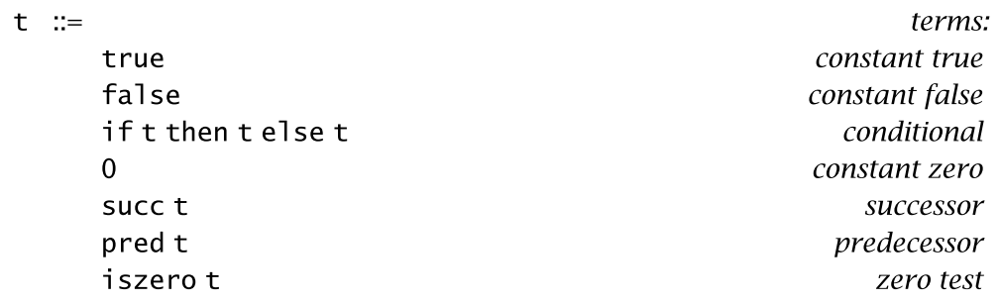
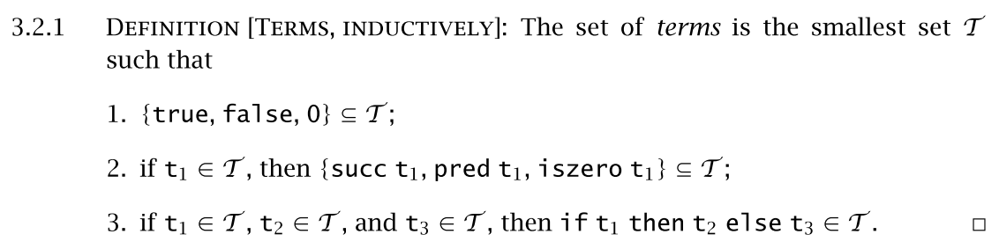
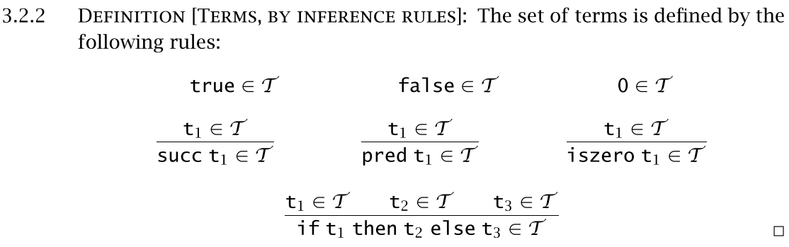
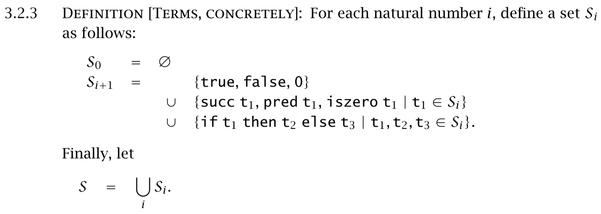
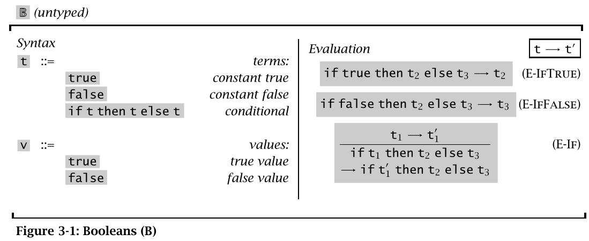
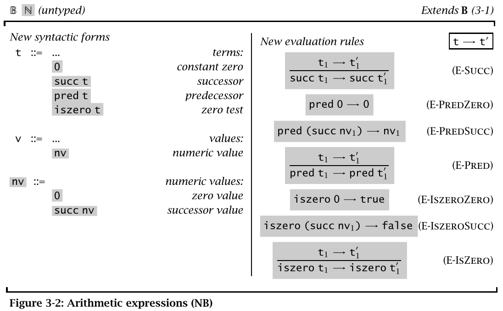
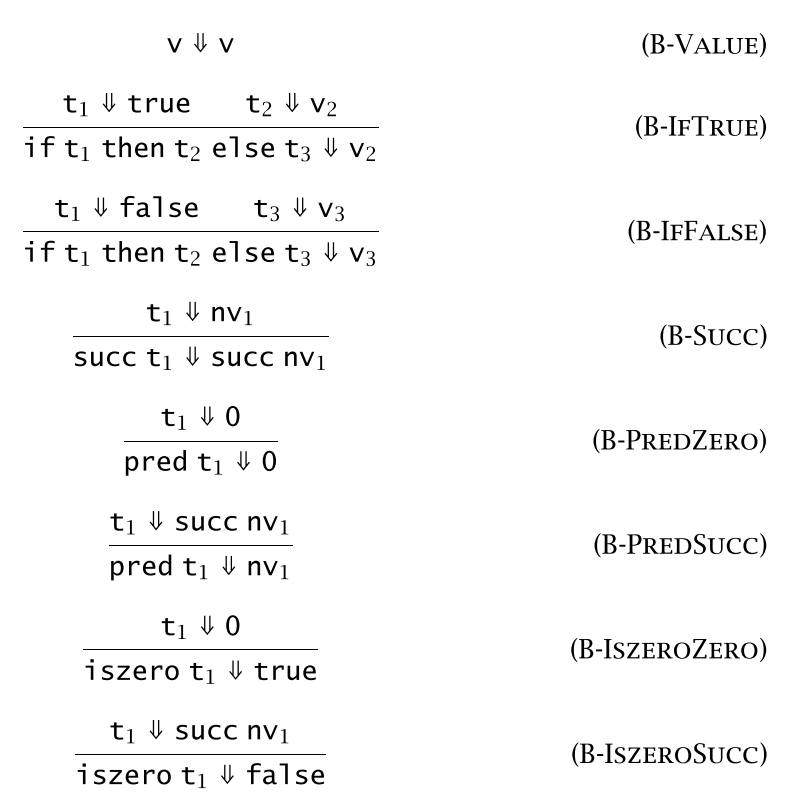

###3.1 *Introduction*
***

Simple grammar used in this charpter.

> succ(succ(succ(0))) is 3
> 
The conventions used in previouse grammar (and throughout the book) are close to those of standard **BNF**:
>- the first line (`t ::=`) declares that we are defining the set of terms, and that we are going to use the letter `t` to range over terms. 
>- each line that follows gives one alternative syntactic form for terms. At every point where the symbol `t` appears, we may substitute any term.

Symbol `t` in this grammar is called a **metavariable**, a variable in the sense that it is a place-holder for some particular term.

***

###3.2 *Syntax*
***
####*Inductive* *definition* of previous grammar

>Rules with no premises (like the first three above) are often called **axioms**.

> S0 is empty; S1 contains just the constants
***

###3.4 Semantic Styles
***
####Operational semantics

Operational semantics specifies the **behavior** of a programming language by defining a simple **abstract machine** for it.
> This machine is “**abstract**” in the sense that it uses the terms of the language as its machine code, rather than some low-level microprocessor instruction set.

Important definitions:
>**state**
>**transition function**

####Denotational semantics
####Axiomatic semantics

***
###3.5 Evaluation
***

The right-hand column defines an **evaluation relation** (or **reduction**) on terms.
The evaluation relation has three **inference rules**.

> Small-step semantic: `t→t'` is pronounced “t evaluates to t' in one step.”

Without `E-If`, we will never know result of `if (if true then true else true) then t1 else t2`. `E-if` means that if conditional expression should be evaluated first.

There is no rule allowing the evaluation of a then- or else-subexpression of an if before evaluating the if itself. For example, the term
`if true then (if false then false else false) else true` does not evaluate to `if true then false else true`.

####Extended semantics of 3-1

> Big-step semantics (or sometimes natural semantics): `t⇓v` “this term evaluates to that final value”.

