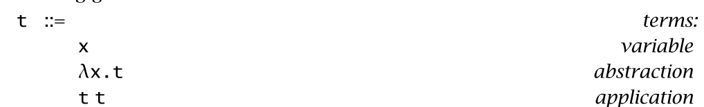

###5.1 Basics
***

Normal function:
`factorial(n) = if n=0 then 1 else n * factorial(n-1)`
If we write `“λn. ...”` as a shorthand for **“the function that, for each n, yields. . .,”** we can restate the definition of factorial as:
`factorial = λn. if n=0 then 1 else n * factorial(n-1)`

> `factorial(0)`
> **means:**
> “the function (λn. if n=0 then 1 else ...) applied to the argument 0,” 
> **means:**
> “the value that results when the argument variable n in the function body (λn. if n=0 then 1 else ...) is replaced by 0,” 
> **means:**
>“if 0=0 then 1 else ...,”
> **means:**
> 1

In the lambda-calculus **everything is a function**: the arguments accepted by functions are themselves functions and the result returned by a function is another function

The syntax of the lambda-calculus comprises just three sorts of terms
- a variable `x` by itself is a term; 
- the abstraction of a variable `x` from a term `t1`, written `λx.t1`, is a term;
- and the application of a term `t1` to another term `t2`, written `t1 t2`, is a term.

