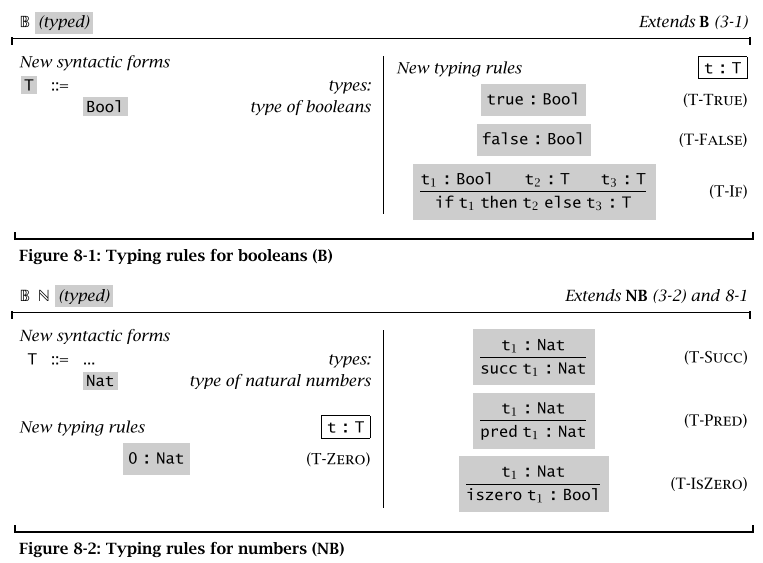

###Useful links
[List of mathematical symbols, definition, latex code](https://en.wikipedia.org/wiki/List_of_mathematical_symbols)
[List of uncode for different symbols](https://en.wikipedia.org/wiki/List_of_XML_and_HTML_character_entity_references)

***
**:** type membership, p92
The typing relation for arithmetic expressions, written1 `t : T`, is defined by a set of inference rules assigning types to terms, summarized in Figures 8- 1 and 8-2.
`t:T` essentially is a set of mapping rules, map a term `t` to `T`. 
`T` is treated a set of terms.

***
**<:** subtyping, is a subtype of, 181
Read `S <: T` as “every value described by `S` is also
described by `T`,” that is, “the elements of `S` are a subset of the elements of `T`.”
`S` is subtype of `T`.

**<.**, cover, is covered by
> `x <. y` means that `x` is covered by `y`

***
**&#915;**, context, p77
For example, suppose that we choose to work under the following naming context:
> **&#915;** =x &#8614; 4
>> y &#8614; 3
>> z &#8614; 2
>> a &#8614; 1
>> b &#8614; 0

Then x (y z) would be represented as `4 (3 2)`.

***
**&#8866;**, inference, infers, is derived from
>x **&#8866;** y means y is derivable from x.

**&#8871;**, entailment, entails
>A **&#8871;** B means the sentence A entails the sentence B, that is in every model in which A is true, B is also true.

***
**&#8594;**, function arrow, from...to
>`f: X`**&#8594;**`Y` means the function `f` maps the set `X` into the set `Y`

**&#8614;**, function arrow, maps to
>`f: a` **&#8614;** `b` means the function `f` maps the element `a` to the element `b`.
